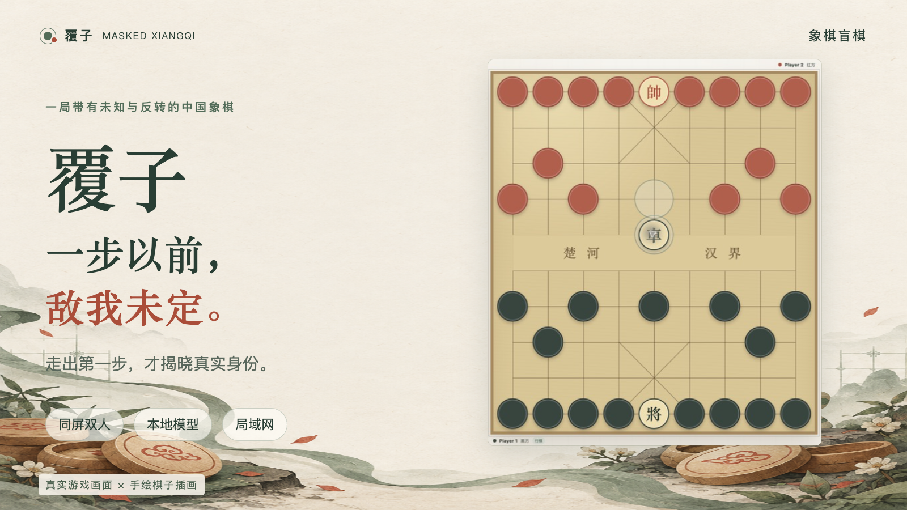
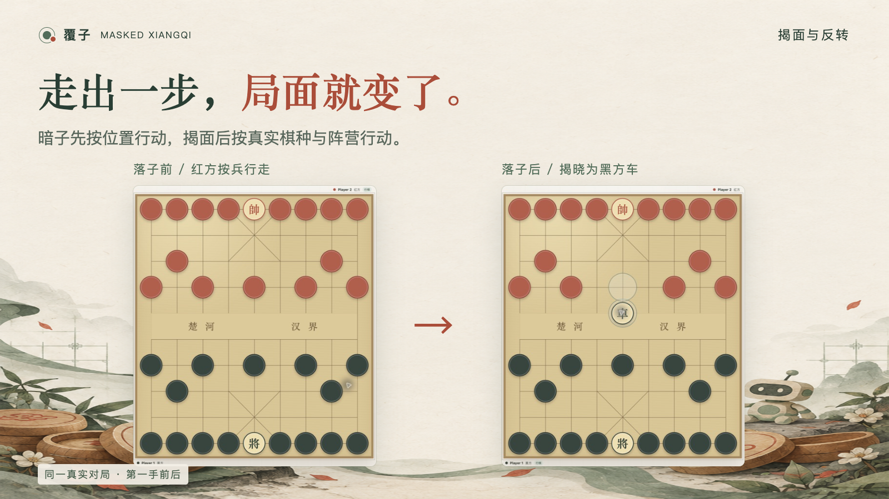
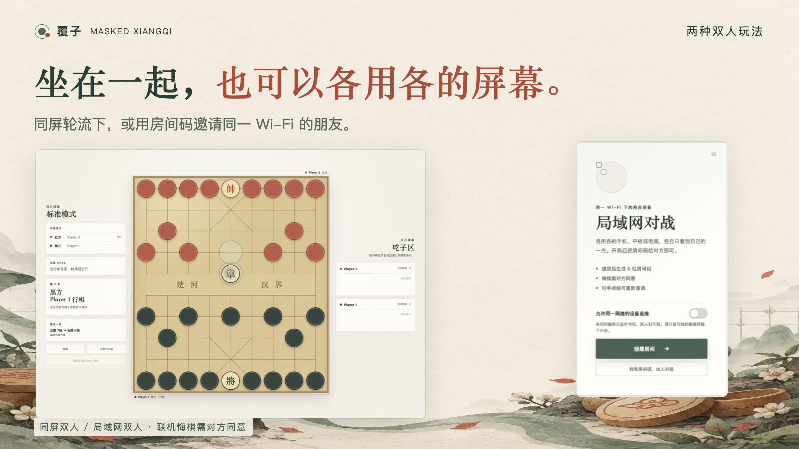
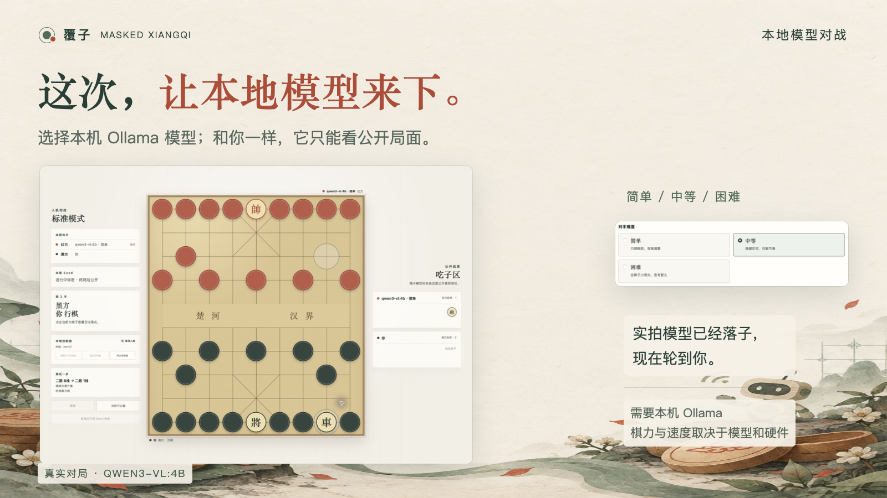
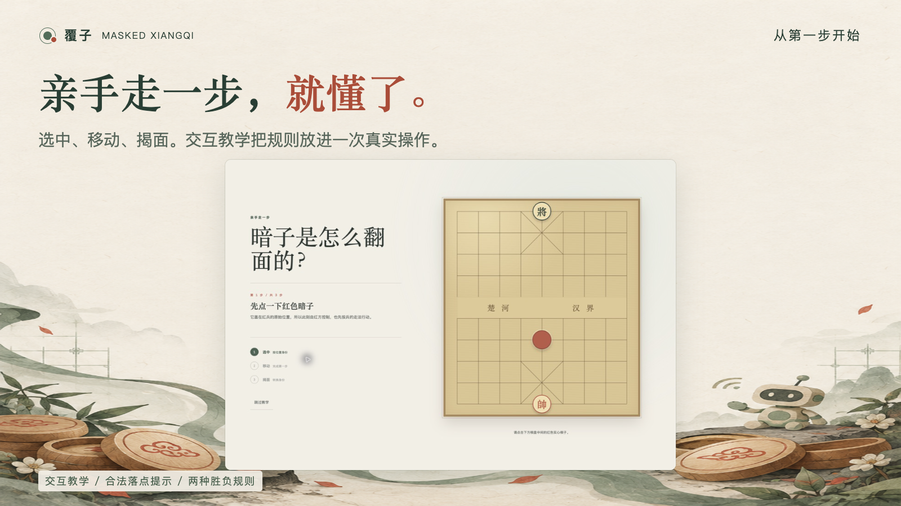

# 覆子 · 象棋盲棋

**一步以前，敌我未定。**

一局带着未知与反转的中国象棋。走出第一步，才揭晓棋子的真实身份。

[开始体验](docs/GUIDE.md) · [更新与实现记录](CHANGELOG.md) · [反馈与建议](https://github.com/zengxuanliu2005/masked_xiangqi/issues)

## 你走出的，未必是你的棋

帅、将明置，其余棋子盖住身份。暗子第一次按所在位置的棋种行走，落子后才揭面——原本按兵走出去的，可能是车，甚至属于对方。

熟悉的九路十线，多了一层猜测，也多了一次重新判断局势的机会。

## 面对面，或者各用各的屏幕

**同屏双人**：一台设备，两个人轮流落子。无需配置模型，就能面对面开一局。

**局域网对战**：同一个 Wi-Fi 下，朋友可以用手机、平板或电脑加入。每个人的执方都在自己棋盘下方；想悔棋，先征得对方同意。

## 三档难度，让本地大模型坐到对面

连接本机 Ollama，选择已有模型，就能试试它下盲棋的表现。简单、中等、困难三档可选；模型和你一样，只能看到已经公开的局面。

简单档偏向快速落子，中等档注重子力得失，困难档更重视攻防与换子判断。实际棋力也取决于所选模型，响应速度受模型与硬件影响。

也可以打开独立控制台，看看模型给出的着法和理由。下得怎样，留给这一局来回答。

## 亲手走一步，比读规则更直观

交互教学带你完成选中、移动、揭面。正式对局中，点击棋子就能查看合法落点。

想认真算棋，可以选标准模式；想直接围绕吃掉主帅来玩，也有吃主帅模式。悔棋、自动和棋都可在开局前选择，终局后还能用同一套初始布子再来一局。

## 开一局

在电脑上启动覆子，然后用浏览器打开。双人对战无需 Ollama；本地模型对战需要另行准备模型。手机和平板可以通过同一网络加入电脑创建的房间。

| 想了解什么             | 从这里开始                |
| ---------------------- | ------------------------- |
| 安装、启动、玩法和联机 | [使用指南](docs/GUIDE.md) |
| 版本变化与具体实现     | [Changelog](CHANGELOG.md) |
| Agent 接入与接口契约   | [API 文档](docs/API.md)   |
| 局域网使用与安全边界   | [安全说明](SECURITY.md)   |

## 许可

源码可查看，采用 [PolyForm Noncommercial 1.0.0](LICENSE)，允许非商业目的下的使用、修改与分发。商业使用需另获书面授权，可通过仓库的“商业授权咨询”Issue 模板联系。

Copyright 2026 zengxuanliu2005.
